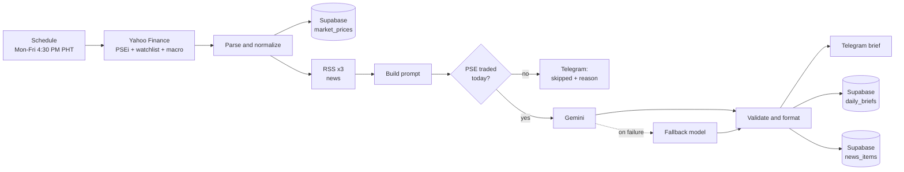

# PSE Daily Market Brief

An automated market-analysis agent for the Philippine Stock Exchange. After each trading session it pulls prices and news, has an LLM summarize the day and sentiment-tag every headline, sends a formatted brief to Telegram, and logs everything to Postgres so the sentiment signal can be backtested later.

Built with **n8n**, **Google Gemini**, **Supabase (PostgreSQL)**, and the **Telegram Bot API**.

> **Not investment advice.** This is a personal engineering project that uses public, unofficial data sources. See [Limitations](#limitations).

---

## What it does

Every weekday at 4:30 PM Manila time (after the 3:00 PM PSE close):

1. **Prices:** fetches daily data for the PSEi, a 13-stock watchlist, and five macro series (USD/PHP, Brent crude, US 10Y yield, S&P 500, Hang Seng) from Yahoo Finance.
2. **News:** reads three sources (BusinessWorld, Philstar Business, and a Google News query for the PSEi), keeps the last 30 hours, and removes duplicates.
3. **Analysis:** sends a compact, numbered prompt to Gemini and asks for structured JSON: overall sentiment, a short summary, drivers, risks, and a sentiment/theme/ticker tag for every headline.
4. **Delivery:** formats the result into a Telegram message with the PSEi move, watchlist breadth, top movers, macro snapshot, drivers, headlines with links, and things to watch.
5. **Logging:** writes prices, the brief, and tagged news to Supabase.

If the PSE did not trade (holiday) or the data is missing, it sends a short "skipped" message that says why, instead of a stale brief.

### Sample output (illustrative data)

```
📊 PSE Daily Brief · Fri, Sep 18
PSEi 6,480.25 (▲ +0.84%) · 5d +1.90% · 20d -1.20%
Watchlist breadth: 7▲ / 5▼

🟡 Sentiment: neutral (+0.15)
Banks led a modest rebound while property and consumer names lagged.

Movers
▲ BDO +2.10% · ALI +1.26% · BPI +1.10%
▼ JFC -2.30% · SMPH -1.60% · SM -0.90%

Macro
USD/PHP 57.85 (+0.18%) · Brent crude 82.40 (-1.10%) · US 10Y yield 4.32 (+0.60%)

Drivers
• Lenders gained on strong loan growth and a steady policy rate.
• Weak same-store sales weighed on consumer names.

Headlines
🟢 <linked headline> (BusinessWorld)
🔴 <linked headline> (Philstar)

Watch
• Oil and the peso remain the main inflation risks.

Automated summary from public data. Not investment advice.
```

<!-- Replace the block above with a real screenshot once you have one:  -->

---

## Architecture



## Design decisions

- **The model never writes links.** Each headline is sent with a numeric ID. The model returns tags by ID, and titles and URLs are joined back from the RSS data in code, so a hallucinated link cannot reach the message.
- **Structured, validated output.** Gemini is asked for JSON. The formatter clamps scores to [-1, 1], checks labels against allowed values, strips code fences, and fails loudly on blocked or malformed responses.
- **Graceful degradation.** The primary model gets up to four attempts; if it still fails, the same request goes to a fallback model. The `model` column records which model actually answered.
- **Robust price parsing.** Yahoo sometimes returns a single daily bar for PSE symbols. The parser falls back to quote fields in the response metadata, and deliberately avoids `chartPreviousClose` (which is the close before the *chart range*, not yesterday's). The PSEi is tried under two Yahoo symbols and stored under one canonical key.
- **Deterministic news aggregation.** The RSS feeds run in a chain with `executeOnce`, and each feed's errors are isolated, so one dead feed doesn't kill the run.
- **Idempotent writes.** Unique keys (`(trade_date, symbol)`, `brief_date`, `url`) mean reruns don't create duplicates.
- **No lookahead in the backtest.** The brief is generated after the close on day *D*, and the SQL views measure returns from the close on *D* forward.

## Data model

| Table | Purpose | Key |
|---|---|---|
| `market_prices` | Daily close, 1-day change, 5d/20d returns, volume ratio for every series | `(trade_date, symbol)` |
| `daily_briefs` | Sentiment label and score, summary, drivers, risks, per-ticker notes, model used, the sent message | `brief_date` |
| `news_items` | Each headline with source, URL, LLM sentiment/score, theme, and tickers | `url` |

Two views support backtesting: `signal_vs_forward_returns` (brief sentiment vs. PSEi 1-day and 5-day forward returns) and `daily_news_sentiment` (aggregate headline sentiment per day). Full DDL is in [`sql/schema.sql`](sql/schema.sql).

Example, once you have a few weeks of data:

```sql
select sentiment_label, count(*) as n,
       round(avg(fwd_1d_pct), 3) as avg_1d,
       round(avg(fwd_5d_pct), 3) as avg_5d
from signal_vs_forward_returns
group by sentiment_label;
```

## Repository layout

```
workflows/
  pse_market_brief.workflow.json   # the production workflow (import into n8n)
  pse_llm_test.workflow.json       # runs the real prompt/format/Telegram path on sample data
sql/schema.sql                     # tables, indexes, RLS, backtesting views
code/                              # the JavaScript inside each n8n Code node, as readable files
tests/                             # Node tests for the parsing/formatting logic (mock data)
```

The `code/` files mirror what is embedded in the workflow JSON so they can be read and tested without opening n8n.

## Setup

**Prerequisites:** an n8n instance (Cloud or self-hosted), a Supabase project, a Telegram bot, and a Google Gemini API key.

1. **Database:** run [`sql/schema.sql`](sql/schema.sql) in the Supabase SQL editor.
2. **Telegram:** create a bot with [@BotFather](https://t.me/BotFather) and message it once. Get your chat ID from `https://api.telegram.org/bot<TOKEN>/getUpdates` (the `chat.id` field).
3. **Import:** in n8n, *Workflows → Import from File* → `workflows/pse_market_brief.workflow.json`.
4. **Credentials:** create and attach these in n8n:
   - Telegram API (bot token)
   - Supabase API (project URL + `service_role` key, used server-side only)
   - Google Gemini (PaLM) API (API key). If n8n rejects this credential type on the HTTP Request node, switch that node to Header Auth with the header `x-goog-api-key`.
5. **Config node:** set `chat_id`, and optionally `model`, `fallback_model`, and `news_max_age_hours`. Confirm model IDs on Google's current models page.
6. **Workflow settings:** timezone `Asia/Manila`, execution order `v1`.
7. **Activate** the workflow.

### Testing

- **Any day, any time:** set `force_run = true` in the Config node to run the full brief on the latest session's data (e.g., on a weekend). Set it back to `false` afterward.
- **LLM path only:** import `workflows/pse_llm_test.workflow.json`. It feeds clearly labeled sample data through the real prompt builder, Gemini call, formatter, and Telegram node, with no database writes.
- **Logic tests:** `node tests/test_harness.js && node tests/test_single_bar.js` (no dependencies).

### Customizing

| What | Where |
|---|---|
| Watchlist and macro tickers | `Build Symbols` node (`code/build_symbols.js`) |
| News feeds | The three RSS nodes (keep names in sync with `SOURCES` in `Build LLM Input`) |
| Prompt and output schema | `Build LLM Input` |
| Message layout | `Format Brief` |
| Schedule | Trigger node (cron `30 16 * * 1-5`) |

## Limitations

- **Unofficial data.** Yahoo Finance is not an official PSE source. Some PSE symbols may be missing, delayed, or have sparse history (in which case 5-day/20-day returns are blank until the database has accumulated enough days). Do not rely on this for trading decisions; use a licensed data feed for anything beyond personal use.
- **LLM sentiment is an opinion, not a measured signal.** Whether it has any predictive value is exactly what the backtest views are for. Expect noise, and treat early results with skepticism.
- **News coverage is limited** to three feeds and a 30-hour window.
- **Holiday handling is data-driven:** a session is treated as "traded" only if the PSEi's latest bar is dated today (Manila time). There is no holiday calendar.
- **Personal-scale.** It runs once a day for one recipient. Serving many subscribers would need a subscriber list, rate-limited sending, and a review of data-redistribution terms.

## Roadmap

- [ ] Add 52-week range and drawdown context to the prompt
- [ ] Pull company disclosures (PSE Edge) as an additional news source
- [ ] Track sentiment-vs-return results over a longer window and publish the findings
- [ ] Optional multi-user delivery (subscriber table, `/start` and `/stop`)
- [ ] Dashboard over the logged data (e.g., Power BI or Streamlit)
